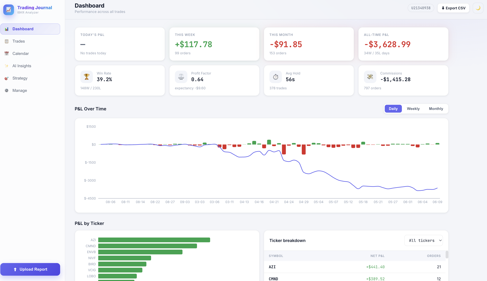
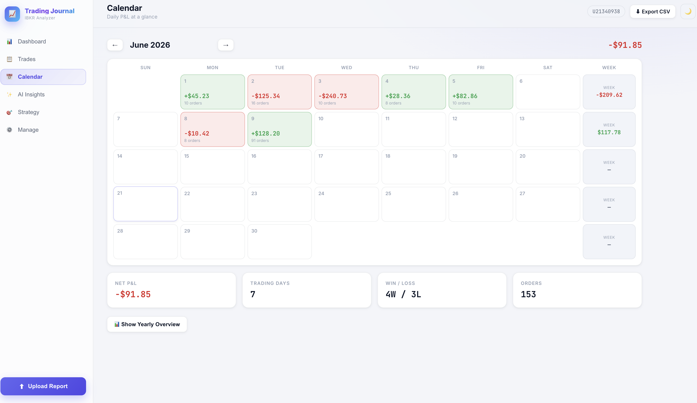
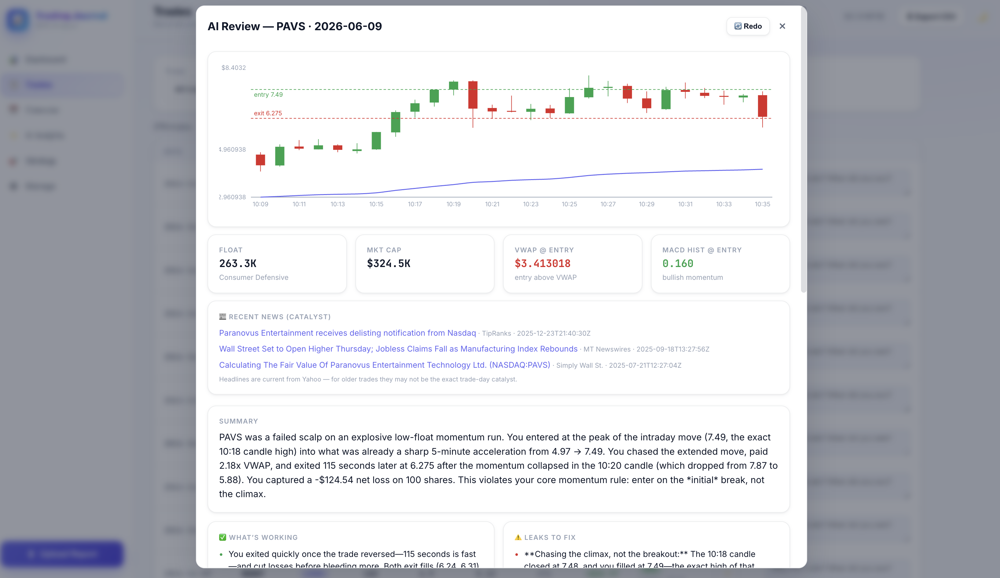
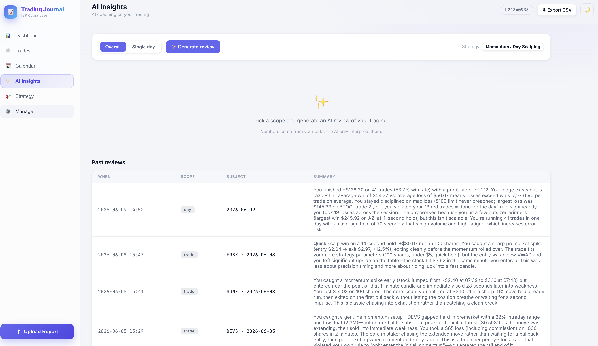

# Trading Journal — AI-Ready Trade Management

## Overview

**Trading Journal** is a comprehensive trade management system that helps you ingest Interactive Brokers trade confirmations, reconstruct round-trip trades, and review your performance with detailed metrics and analytics.

Built as a **Python modular monolith** with a clean `core` at its center and a modern **React TypeScript** frontend on top. The architecture is designed for extensibility — ground truth lives in simple, testable core logic while the API, storage, and (future) AI layers consume it cleanly.

> **Design Philosophy**: Accurate data and metrics come first. AI analysis sits on top of numbers you already trust — not the other way around.

> **Note**: The code is currently private. I apologize for this limitation! This README and screenshots showcase the project's architecture and capabilities. If you're interested in collaborating or learning more about the project, please feel free to reach out.

### Key Features

**IBKR Report Ingestion** — Import trade confirmations directly from Interactive Brokers  
**Smart Trade Reconstruction** — Automatically reconstruct round-trip trades from raw orders  
**Comprehensive Metrics** — P&L tracking, win rate, hold time, and statistical analysis  
**Interactive Dashboard** — Real-time performance overview and trade-by-trade review  
**Calendar View** — Daily P&L visualization and trade history  
**AI-Ready Architecture** — Clean separation of concerns, ready for AI layer integration  
**Type-Safe** — Full TypeScript frontend + Python FastAPI backend

## Gallery

### Dashboard — Performance at a Glance


### Calendar — Daily P&L & Trade History


### AI Insights — Coaching on Your Trading


### Detailed Trade Analysis — Deeper Review


## Architecture

The project follows a **modular monolith** pattern with clear separation of concerns:

```
journal-ai/
├── backend/                  Python · FastAPI · pandas
│   ├── core/                 PURE logic — no web, no DB, no AI
│   │   ├── ingest/           IBKR .htm  ->  Order objects
│   │   ├── reconstruct/      Orders     ->  round-trip Trades  (position walk)
│   │   └── metrics/          Orders/Trades -> P&L + statistics
│   ├── storage/              Repository interface + CSV implementation
│   │   ├── base.py           the contract (swap CSV -> Postgres here later)
│   │   └── csv_store.py      today's CSV-backed store
│   ├── api/                  FastAPI: thin HTTP layer over core + storage
│   ├── scripts/migrate_csv.py   legacy trades.csv -> new order store
│   ├── tests/                pytest (parser, reconstruction, metrics)
│   └── data/                 orders.csv + notes.csv live here (gitignored)
│
└── frontend/                 React · TypeScript · Vite · Recharts
    └── src/
        ├── pages/            Dashboard · Trades · Calendar · Upload
        ├── api.ts            typed client
        └── types.ts          mirrors backend models
```

### Design Principle

**`core/` knows nothing about HTTP, storage, or AI.** The API consumes it, a future Postgres layer will consume it, and the future AI layer will consume it. The logic is written once and stays testable.

### Orders vs Trades

- **Order** — one row from IBKR: a single executed order. The immutable log.
- **Trade** — a reconstructed round-trip (entry → scale → exit), *derived* from
  orders by walking the position from flat back to flat. This is what win rate,
  hold time, and (later) AI review operate on.

## Quick Start

### Prerequisites
- Python 3.9+
- Node.js 18+
- Interactive Brokers account (for trade data)

### Backend Setup

```bash
cd backend
python3 -m venv .venv && source .venv/bin/activate
pip install -e ".[dev]"

# Import your existing trades (if any)
python scripts/migrate_csv.py ../trades.csv

# Start the API server
uvicorn api.main:app --reload --port 8000
# API docs available at http://localhost:8000/docs
```

### Frontend Setup

```bash
cd frontend
npm install
npm run dev
# Opens at http://localhost:5173 (automatically proxies /api to :8000)
```

### Running Tests

```bash
cd backend && source .venv/bin/activate
pytest
```

## Roadmap — What's Next

- **Postgres Integration** — Swap CSV backend for production-grade Postgres
  - Add `PostgresRepository` implementing `storage/base.py`
  - Change one line in `api/deps.py` — core logic stays untouched
- **AI Layer** — Narrative analysis on top of trade data
  - Consumes `core` outputs (trades + metrics) as ground truth
  - Generates trading insights and behavioral coaching
- **Advanced Analytics** — Drawdown analysis, Monte Carlo simulation
- **Trade Alerts** — Real-time notifications for rule violations
- **Multi-Strategy Support** — Track and compare different trading approaches

## 🛠️ Tech Stack

| Layer | Technology | Purpose |
|-------|-----------|---------|
| **Backend** | Python 3.9+ | Language |
| | FastAPI | REST API framework |
| | pandas | Data manipulation & metrics |
| | pytest | Testing |
| **Frontend** | React 18+ | UI framework |
| | TypeScript | Type-safe scripting |
| | Vite | Module bundler |
| | Recharts | Data visualization |
| **Storage** | CSV (current) | Simple store; easy migration |
| | Postgres (planned) | Production database |

## License

This project is open source. Feel free to explore, modify, and build on it.

## Contributing

Contributions are welcome! Whether it's bug reports, feature suggestions, or code improvements, please feel free to open an issue or submit a pull request.
